# Итоговая аттестация

### Необходимо организовать систему учета для питомника в котором живут домашние и вьючные животные.

1. Используя команду cat в терминале операционной системы Linux, создать два файла Домашние животные (заполнив файл собаками, кошками, хомяками) и Вьючные животными (заполнив файл Лошадьми, верблюдами и ослы), а затем объединить их. Просмотреть содержимое созданного файла. Переименовать файл, дав ему новое имя (Друзья человека).

    ```shell
        $ cat > Домашние_животные.txt
        животное имя дата рождения
        собака Пёс 2015-09-01
        собака Рекс 1994-11-10
        собака Найда 1984-12-21
        кошка Ксюша 2014-05-25
        кошка Муся 2010-03-30
        кошка Барсик 2023-04-01
        хомяк Роза 2003-05-01
        хомяк Эльза 2017-09-18
        хомяк Рыжик 2024-02-01
        
        $ cat > Вьючные_животные.txt
        животное имя дата рождения
        лошадь Освинд 2013-01-01
        лошадь Гнедой 2018-10-05
        лошадь Идальго 2004-03-05
        верблюд Горбатый 2020-02-02
        верблюд Плевака 2000-11-01
        верблюд Бонго 2021-06-15
        осёл Янки 2022-12-24
        осёл Иа-иа 1969-07-19
        осёл Мокко 2023-01-20
        
        $ cat Домашние_животные.txt Вьючные_животные.txt > животные.txt
        $ mv животные.txt Друзья_человека.txt
        $ ls -a
        $ cat Друзья_человека.txt
    ```
    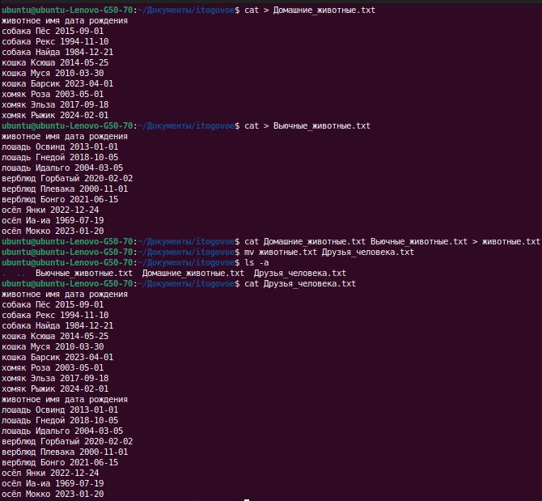

2.  Создать директорию, переместить файл туда.

    ```shell
        $ mkdir animals
        $ mv Друзья_человека.txt animals/
        $ tree
    ```

    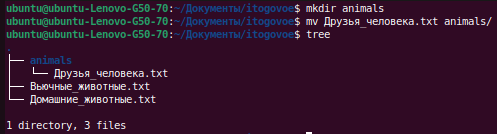

3. Подключить дополнительный репозиторий MySQL. Установить любой пакет из этого репозитория.
   
   ```shell
      $ sudo wget https://dev.mysql.com/get/mysql-apt-config_0.8.24-1_all.deb
      $ sudo dpkg -i mysql-apt-config*
      $ sudo apt update 
      $ sudo apt install mysql-server mysql-client
      $ systemctl status mysql.service
   ```

    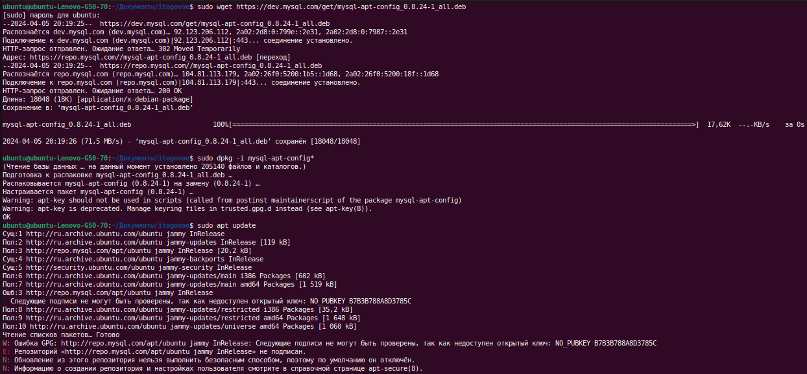
    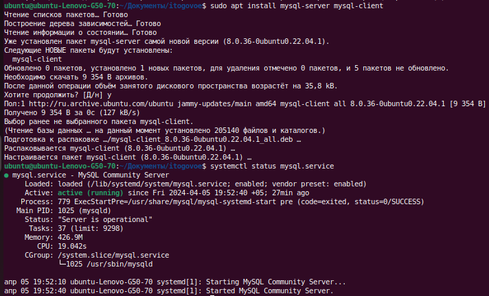

4. Установить и удалить deb-пакет с помощью dpkg.

   ```shell
        $ sudo wget https://dev.mysql.com/get/mysql-apt-config_0.8.24-1_all.deb
        $ sudo dpkg -i mysql-apt-config*
        $ sudo dpkg -r mysql-apt-config
        $ sudo dpkg --purge mysql-apt-config
   ```

    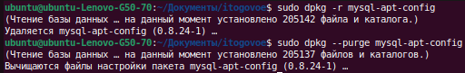

5. Выложить историю команд в терминале ubuntu.

   ```shell
        $ history 
   ```

    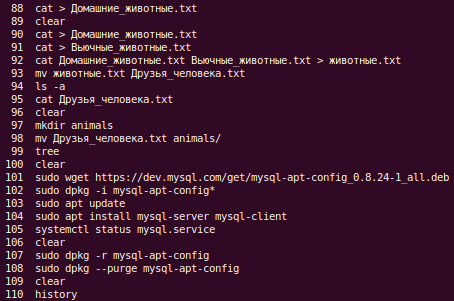

6. Нарисовать диаграмму, в которой есть класс родительский класс, домашние животные и вьючные животные, в составы которых в случае домашних животных войдут классы: собаки, кошки, хомяки, а в класс вьючные животные войдут: Лошади, верблюды и ослы).

    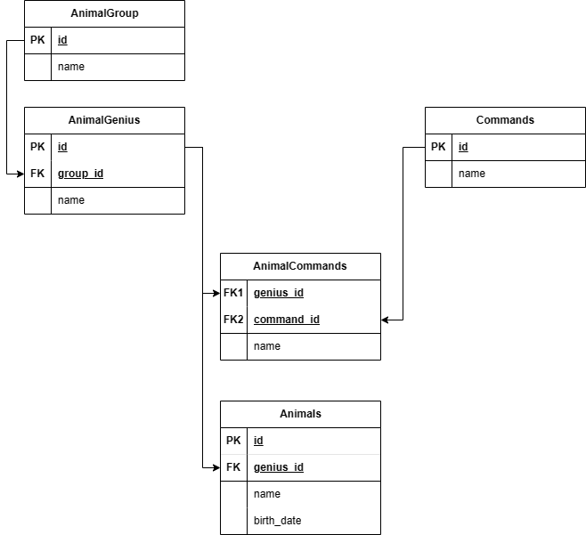
   
7. В подключенном MySQL репозитории создать базу данных “Друзья человека”.

   ```shell
        $ sudo mysql
   ```
   
   ```
   CREATE DATABASE IF NOT EXISTS HumanFriends;
   USE HumanFriends;
   ```

    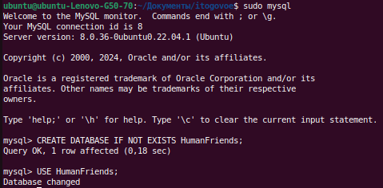
   
8. Создать таблицы с иерархией из диаграммы в БД.

   ```
   CREATE TABLE AnimalGroup
   (
    id INT PRIMARY KEY NOT NULL AUTO_INCREMENT,
    name varchar(30)
   );

   CREATE TABLE AnimalGenius
   (
    id INT PRIMARY KEY NOT NULL AUTO_INCREMENT,
    name varchar(30),
    group_id INT,
    FOREIGN KEY (group_id) REFERENCES AnimalGroup (id)
    ON DELETE CASCADE ON UPDATE CASCADE
   );

   CREATE TABLE Commands
   (
    id INT PRIMARY KEY NOT NULL AUTO_INCREMENT,
    name varchar(30)
   );

   CREATE TABLE AnimalCommands
   (
    genius_id INT,
    command_id INT,
    FOREIGN KEY (genius_id) REFERENCES AnimalGenius (id)
    ON DELETE CASCADE ON UPDATE CASCADE,
    FOREIGN KEY (command_id) REFERENCES Commands (id)
    ON DELETE CASCADE ON UPDATE CASCADE
   );

   CREATE TABLE Animals
   (
    id INT PRIMARY KEY NOT NULL AUTO_INCREMENT,
    name varchar(30),
    birth_date DATE,
    genius_id INT,
    FOREIGN KEY (genius_id) REFERENCES AnimalGenius (id)
    ON DELETE CASCADE ON UPDATE CASCADE
   );
   ```

    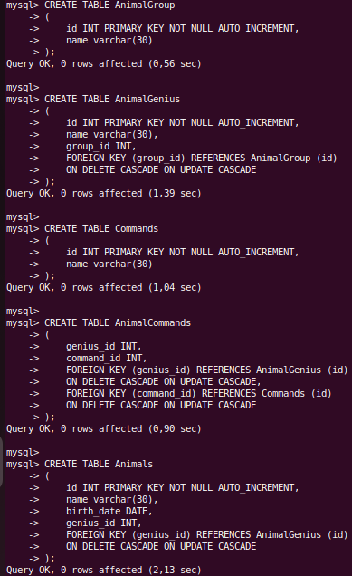

9. Заполнить низкоуровневые таблицы именами(животных), командами которые они выполняют и датами рождения.

   ```
   USE HumanFriends;

   INSERT INTO AnimalGroup (name)
   VALUES
    ('Домашние животные'),
    ('Вьючные животные');

   INSERT INTO AnimalGenius (name, group_id)
   VALUES
    ('Собака', 1),
    ('Кошка', 1),
    ('Хомяк', 1),
    ('Лошадь', 2),
    ('Верблюд', 2),
    ('Осёл', 2);

   INSERT INTO Commands (name)
   VALUES
    ('Голос'),
    ('Сидеть'),
    ('Стоять'),
    ('Лежать'),
    ('Апорт'),
    ('Место'),
    ('Кушать'),
    ('Вперёд'),
    ('Влево'),
    ('Вправо'),
    ('Пятиться');

   INSERT INTO AnimalCommands (genius_id, command_id)
   VALUES
    (1, 1), (2, 1), (4, 1), 
    (1, 2), (2, 2), (3, 2), 
    (1, 3), (2, 3), (4, 3), (5, 3), (6, 3), 
    (1, 4), (2, 4), (3, 4), (4, 4), 
    (1, 5), (2, 5), (4, 5), 
    (1, 6), (2, 6), (4, 6), (5, 6), 
    (1, 7), (2, 7), (3, 7), (4, 7), (5, 7), (6, 7), 
    (4, 8), (5, 8), (6, 8), 
    (4, 9), (5, 9), (6, 9), 
    (4, 10), (5, 10), (6, 10), 
    (4, 11), (5, 11);

   INSERT INTO Animals (name, birth_date, genius_id)
   VALUES
    ('Пёс', '2015-09-01', 1),
    ('Рекс', '1994-11-10', 1),
    ('Найда', '1984-12-21', 1),
    ('Ксюша', '2014-05-25', 2),
    ('Муся', '2010-03-30', 2),
    ('Барсик', '2023-04-01', 2),
    ('Роза', '2003-05-01', 3),
    ('Эльза', '2017-09-18', 3),
    ('Рыжик', '2024-02-01', 3),
    ('Освинд', '2013-01-01', 4),
    ('Гнедой', '2018-10-05', 4),
    ('Идальго', '2004-03-05', 4),
    ('Горбатый', '2020-02-02', 5),
    ('Плевака', '2000-11-01', 5),
    ('Бонго', '2021-06-15', 5),
    ('Янки', '2022-12-24', 6),
    ('Иа-иа', '1969-07-19', 6),
    ('Мокко', '2023-01-20', 6);
   ```

    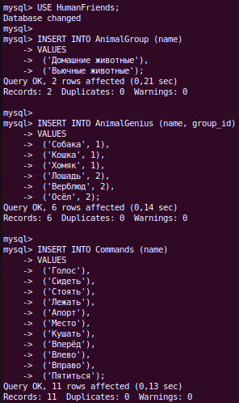
    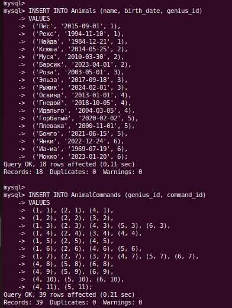

10. Удалив из таблицы верблюдов, т.к. верблюдов решили перевезти в другой питомник на зимовку. Объединить таблицы лошади, и ослы в одну таблицу.

   ```
   USE HumanFriends;
   DELETE FROM Animals WHERE genius_id = 5;

   CREATE TABLE HorseAndDonkey AS
   SELECT * from Animals WHERE genius_id = 4
   UNION
   SELECT * from Animals WHERE genius_id = 6;
   ```

   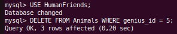
   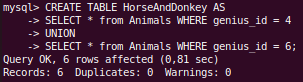

11. Создать новую таблицу “молодые животные” в которую попадут все животные старше 1 года, но младше 3 лет и в отдельном столбце с точностью до месяца подсчитать возраст животных в новой таблице.

   ```
   CREATE TABLE YoungAnimals AS
      SELECT id, name, birth_date, 
      concat(floor(datediff(curdate(), birth_date) /30/12), ' лет, ',  FLOOR(datediff(curdate(), birth_date) /30) - floor(datediff(curdate(), birth_date) /30/12)*12, ' месяцев') as age, 
      genius_id 
      from Animals 
      WHERE date_add(birth_date, INTERVAL 1 YEAR) < curdate() 
            AND date_add(birth_date, INTERVAL 3 YEAR) > curdate();
   
   SELECT * from YoungAnimals;
   ```

   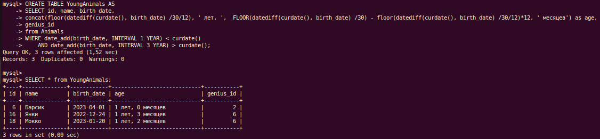

12. Объединить все таблицы в одну, при этом сохраняя поля, указывающие на прошлую принадлежность к старым таблицам.

   ```
   SELECT id, name, birth_date, genius_id FROM HorseAndDonkey
   UNION
   SELECT id, name, birth_date, genius_id FROM YoungAnimals
   UNION
   SELECT id, name, birth_date, genius_id FROM Animals;
   ```

   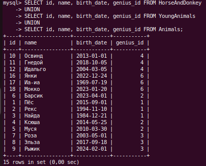

13. Создать класс с Инкапсуляцией методов и наследованием по диаграмме.
14. Написать программу, имитирующую работу реестра домашних животных.

    src > java > com > blinovaed > registry
    
